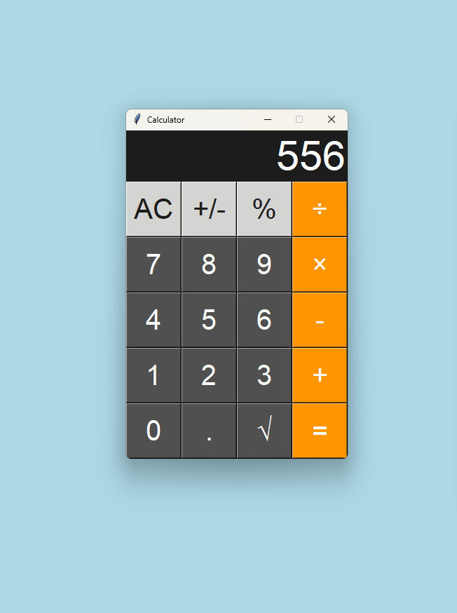
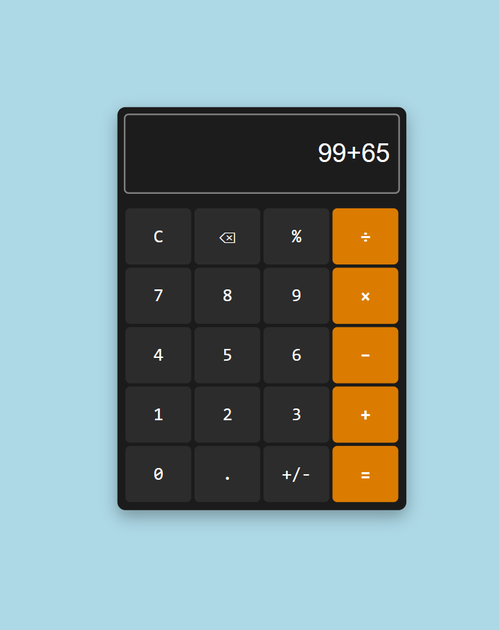
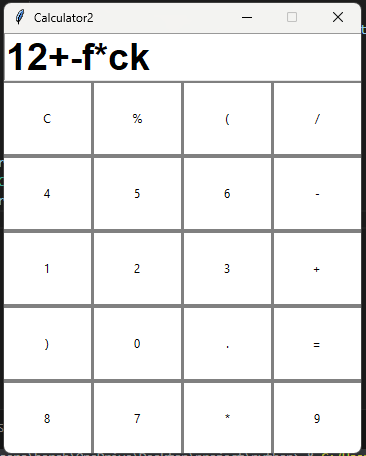

# 🧮 Simple Calculator Collection

This repository contains two basic calculator implementations:

- ✅ A **Python GUI calculator** using Tkinter.
- ✅ A **Web-based calculator** using HTML, CSS, and JavaScript.

---

## 📸 Previews

### 🐍 Python Calculator

> A basic calculator built using Python’s Tkinter library. It supports:
> - Addition, subtraction, multiplication, division
> - Clear and delete functionality
> - Simple, desktop-friendly interface

---

### 🌐 Web Calculator

> A modern calculator built with HTML, CSS, and JavaScript. Features include:
> - Grid layout
> - Keyboard input support
> - Repeat `=` operation memory
> - Dark-themed UI with hover/active effects

---
### 🐍 Python Calculator 2nd test

## 📁 Project Structure

